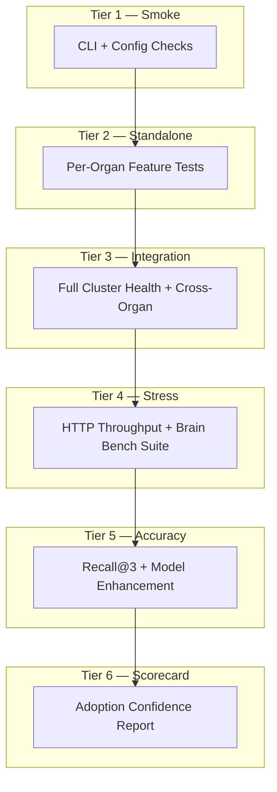

# Agent Benchmarks

Comprehensive testing, benchmarking, and adoption-confidence reporting for the [Autonomic AI](https://github.com/autonomic-ai-dev/agent-body) ecosystem.

## Architecture



## Quick Start

```bash
# Install task runner (if not already installed)
brew install go-task

# Run the complete pipeline
task all

# Or run individual tiers:
task test:smoke              # CLI binary and config checks
task test:standalone         # All organ feature tests
task test:integration        # Full cluster health + cross-organ communication
task benchmark:stress        # HTTP throughput across all daemons
task benchmark:brain         # Native brain bench suite (latency gates)
task benchmark:accuracy      # Recall@3, BEAM, token savings
task benchmark:model MODEL=qwen2.5-coder:7b  # Before/after model comparison (Ollama)
task scorecard               # Generate the Autonomic AI Scorecard
```

## Model Comparison

The model comparison benchmark uses **Ollama** (local) or **HuggingFace Inference API** for pluggable open-source models. Generated code is executed in a **Docker sandbox** (`--network=none`, memory-limited) for safe verification.

```bash
# Using Ollama (default)
task benchmark:model MODEL=codellama:7b

# Using HuggingFace
HUGGINGFACE_TOKEN=hf_xxx task benchmark:model MODEL=bigcode/starcoder2-7b PROVIDER=huggingface
```

## Scorecard

After running benchmarks, generate the adoption confidence scorecard:

```bash
task scorecard
```

This produces `benchmarks/scorecard.md` — a single artifact showing system health, performance metrics, accuracy evaluations, token savings, and model enhancement results.

## Project Structure

```
agent-benchmarks/
├── Taskfile.yml                          # Task automation
├── docker-compose.integration.yml        # Full cluster orchestration
├── docker-compose.standalone.yml         # Isolated organ testing
├── docker/
│   └── Dockerfile.agent                  # Universal organ image
├── tests/
│   ├── requirements.txt
│   ├── standalone/
│   │   ├── test_smoke.py                 # Tier 1: CLI smoke tests
│   │   ├── test_brain_features.py        # Tier 2: Brain features
│   │   ├── test_spine_features.py
│   │   ├── test_heart_features.py
│   │   ├── test_nerves_features.py
│   │   ├── test_muscle_features.py
│   │   ├── test_immune_features.py
│   │   ├── test_eyes_features.py
│   │   └── test_mouth_features.py
│   └── integration/
│       └── test_cluster.py               # Tier 3: Cluster integration
└── benchmarks/
    ├── stress_test.py                    # Tier 4: HTTP throughput
    ├── brain_bench.py                    # Tier 4: Native brain benchmarks
    ├── accuracy_eval.py                  # Tier 5: Recall & token savings
    ├── model_comparison.py              # Tier 5: Before/after with Ollama
    ├── scorecard.py                      # Tier 6: Adoption scorecard
    ├── prompts/
    │   └── curated_prompts.json          # Standardized coding prompts
    └── sandbox/
        └── Dockerfile.sandbox            # Network-isolated code executor
```
