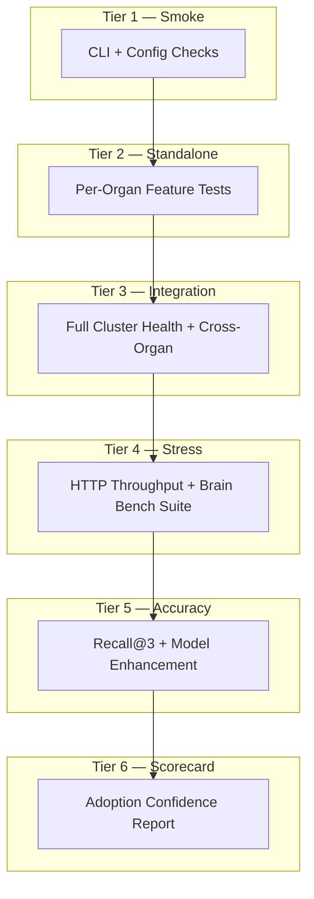

# agent-benchmarks

**Cloud-Native role: Conformance testing** (Sonobuoy analog) — tiered CI, integration compose, and adoption scorecards for the Autonomic platform.

Part of the **[Autonomic AI](https://github.com/autonomic-ai-dev/agent-body)** stack. Validates every daemon binary, runs Docker-based integration tests against a full mesh, and produces graded scorecards for release gates.

| Standalone | Integrated |
|------------|------------|
| `task test:smoke` | Uses release binaries from `install-all-organs.sh` |
| Docker compose tiers | Probes NATS, spine, and organ HTTP health |
| JSON/Markdown reports | Consumable by agent-spine CI and humans |

---

## Why agent-benchmarks?

| Problem | agent-benchmarks answer |
|---------|------------------------|
| Components ship without cross-checks | **6-tier conformance pipeline** — smoke → standalone → integration → stress → accuracy → scorecard |
| CLI drift breaks silently | **Standalone tests** — every daemon exercised in Docker |
| "Is the mesh healthy?" unknown | **Integration compose** — NATS + spine + all daemons |
| No release confidence artifact | **Scorecard** — features graded with latency/token SLAs |



---

## Quick Install

Prerequisites: [Docker](https://docs.docker.com/get-docker/), [Task](https://taskfile.dev/) (`brew install go-task`).

Organ binaries are pulled inside Docker via [agent-body/install-all-organs.sh](https://github.com/autonomic-ai-dev/agent-body/blob/master/scripts/install-all-organs.sh) — no local Rust build required for `task all`.

```bash
git clone https://github.com/autonomic-ai-dev/agent-benchmarks.git && cd agent-benchmarks
task build
task test:smoke
```

Full pipeline:

```bash
task all
```

---

## Main features

| Feature | Command | Why use it |
|---------|---------|------------|
| **Smoke tests** | `task test:smoke` | Every organ `--version` and CLI sanity |
| **Standalone features** | `task test:standalone` | Per-organ CLI/API coverage |
| **Integration cluster** | `task test:integration` | NATS + spine + cross-organ paths |
| **HTTP stress** | `task benchmark:stress` | Throughput across daemon health endpoints |
| **Brain bench suite** | `task benchmark:brain` | Latency gates, MCP, graphify, scale |
| **Accuracy eval** | `task benchmark:accuracy` | Recall@3, BEAM, token savings |
| **Ecosystem bench** | `task benchmark:ecosystem` | 43 features with graded thresholds |
| **Architecture claims** | `task benchmark:architecture` | Fault isolation, determinism, sovereignty |
| **Resource matrix** | `task benchmark:matrix:quick` | RAM/CPU profiles per organ |
| **Scorecard** | `task scorecard` | Single adoption-confidence artifact |

---

## Commands

| Command | Description |
|---------|-------------|
| `task build` | Build Docker test-runner and autonomic-base images |
| `task test:smoke` | Tier 1 — CLI smoke |
| `task test:standalone` | Tier 2 — all organ feature tests |
| `task test:integration` | Tier 3 — full cluster in compose |
| `task benchmark:stress` | HTTP stress against health endpoints |
| `task benchmark:brain` | Native agent-brain bench suite |
| `task benchmark:accuracy` | Recall@3 and BEAM evals |
| `task benchmark:ecosystem` | 43-feature ecosystem benchmark |
| `task benchmark:architecture` | Architecture claims validation |
| `task benchmark:matrix:quick` | Resource matrix (minimal + standard) |
| `task scorecard` | Generate `benchmarks/scorecard.md` |
| `task all` | Complete pipeline (all tiers) |

---

## Model comparison

Uses **Ollama** (local) or **HuggingFace Inference API**. Generated code runs in a **Docker sandbox** (`--network=none`, memory-limited).

```bash
task benchmark:model MODEL=codellama:7b
HUGGINGFACE_TOKEN=hf_xxx task benchmark:model MODEL=bigcode/starcoder2-7b PROVIDER=huggingface
```

---

## Local setup

```bash
git clone https://github.com/autonomic-ai-dev/agent-benchmarks.git && cd agent-benchmarks
brew install go-task
task build
task test:smoke
task test:standalone
# integration (requires Docker daemon):
task test:integration
```

Reports land in `benchmarks/` (`results_*.md`, `results_*.json`, `scorecard.md`). Generated artifacts are gitignored.

---

## Project structure

```
agent-benchmarks/
├── Taskfile.yml
├── docker-compose.integration.yml
├── docker-compose.standalone.yml
├── docker/Dockerfile.test
├── tests/standalone/          # per-organ pytest
├── tests/integration/           # cluster pytest
└── benchmarks/                # stress, brain, accuracy, ecosystem, scorecard
```

Related repos: [agent-body](https://github.com/autonomic-ai-dev/agent-body) · [agent-brain](https://github.com/autonomic-ai-dev/agent-brain) · [agent-spine](https://github.com/autonomic-ai-dev/agent-spine)

---

## Development

```bash
task --list
task test:edge-cases
python benchmarks/ecosystem_bench.py --organs brain spine
```

---

## Releases

See [CHANGELOG.md](CHANGELOG.md). Tag `v1.0.0+` for benchmark suite milestones.

## License

MIT
